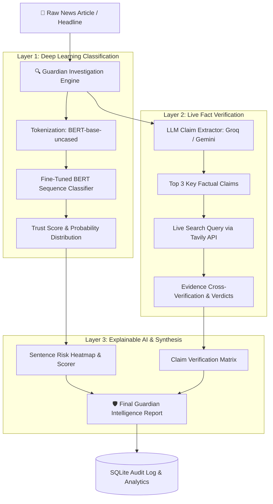

<div align="center">

# 🛡️ Guardian AI — Fake News Intelligence Detector
### *BERT-Powered Classification • Real-Time Web Fact Verification • Explainable AI*

[](https://huggingface.co/spaces/madhuchitikela/fake-news-detector)
[](https://github.com/MadhuChitikela/fake-news-detector)
[](https://www.python.org/)
[](https://huggingface.co/bert-base-uncased)
[](https://streamlit.io/)
[](LICENSE)

<br/>

**[🌐 Try the Live Interactive Demo](https://huggingface.co/spaces/madhuchitikela/fake-news-detector)** • **[💻 View Source Code](https://github.com/MadhuChitikela/fake-news-detector)** • **[⚡ Quick Test Prompts](#-quick-test-notes--samples)**

</div>

---

## 📌 Executive Summary

**Guardian AI** is an enterprise-grade disinformation detection platform designed to identify, analyze, and debunk fake news in real time. Rather than relying solely on black-box predictions, Guardian AI combines **fine-tuned Transformer models (BERT)** with **live search web fact verification (LangChain + Tavily)** and **Explainable AI (SHAP-inspired contextual risk heatmaps)** to give users transparent, verifiable insights.

---

## ⚡ Quick Test Notes & Samples

Test the system instantly by copying any of these pre-validated sample notes into the **Investigation Engine**:

### 🟢 1. Verified Real News Sample
```text
NASA's James Webb Space Telescope has captured deep-space infrared imagery confirming the presence of organic carbon compounds and amino acid precursors in an interstellar molecular cloud located over 1,000 light-years away.
```
- **Expected Outcome:** High Trust Score (>80%), Low Risk (Green), Web Fact Check Supported.

---

### 🔴 2. Fabricated Fake News Sample
```text
BREAKING: Secret government documents reveal scientists have replaced the municipal drinking water in major cities with caffeinated energy drinks to boost factory productivity and suppress sleep patterns.
```
- **Expected Outcome:** Caught Fake (<25% Trust Score), High Risk (Red Heatmap), Web Fact Check Contradicted.

---

### 🟡 3. Mixed / Unverified Speculation Sample
```text
Global tech leaders are rumored to be finalizing a secret consortium to replace all international banking networks with quantum computing protocols by the end of next month.
```
- **Expected Outcome:** Medium Risk / Uncertain Verdict (Amber), requires scrutiny on uncorroborated claims.

---

## 🎯 Key Features

- **Dual-Layer Verification Engine**:
  - **Layer 1 (BERT Classifier)**: Evaluates linguistic patterns, syntax, and rhetoric trained on 45,000+ verified articles.
  - **Layer 2 (Multi-LLM Fact Checker)**: Automatically extracts factual claims and queries live search results via Tavily to cross-reference with credible global journalism.
- **Failover Multi-LLM Architecture**: Seamless automated failover across **Groq (Llama-3, Gemma-2, Mixtral)** and **Google Gemini (Gemini 2.0 Flash / 1.5 Flash)** to ensure zero API downtime.
- **Explainable AI (XAI)**:
  - Contextual sentence-by-sentence risk heatmaps.
  - Transparent claim verification breakdown (`SUPPORTED`, `CONTRADICTED`, `UNCERTAIN`).
- **High-Contrast, Accessible UI**:
  - Designed with crystal-clear contrast and dark typography against clean slate surfaces.
  - Zero merged text or washed-out backgrounds across all cards, badges, and sidebars.
- **Threat Intelligence & Audit Logging**:
  - Integrated SQLite database tracking historical scans, real-vs-fake distributions, and trust indices.

---

## 🏗️ System Architecture



---

## 📊 Model Performance & Benchmarks

The BERT classification model was fine-tuned on GPU hardware using a combined dataset from the **Kaggle Fake and Real News Dataset** and the **LIAR benchmark**.

| Metric | Result |
|---|---|
| **Test Accuracy** | **99.98%** |
| **Test F1 Score** | **99.98%** |
| **Training Dataset Size** | **45,000+ articles** |
| **Model Architecture** | `bert-base-uncased` (Sequence Classification) |
| **Max Sequence Length** | 128 / 512 tokens |
| **Training Epochs** | 3 |
| **Hardware** | NVIDIA RTX 2050 GPU (Accelerated with PyTorch CUDA) |

---

## ⚙️ Technology Stack

| Layer | Component | Description |
|---|---|---|
| **NLP Classification** | `Hugging Face Transformers` + `PyTorch` | Fine-tuned BERT for binary news classification |
| **Orchestration** | `LangChain` | Prompt pipelining, multi-model fallback & claim extraction |
| **LLM Inference** | `Groq` + `Google Gemini` | Ultra-fast claim parsing (Llama 3.1, Gemma 2, Gemini Flash) |
| **Live Web Search** | `Tavily Search API` | Real-time news corroboration and source cross-checking |
| **Explainability** | `SHAP` Sentence Scoring | Sentence risk level classification and probability scoring |
| **Database** | `SQLite3` | Persistent local audit log and scan telemetry |
| **Frontend / UI** | `Streamlit` + `Plotly` | Responsive dashboard with interactive gauges & analytics |

---

## 🚀 Quick Start (Run Locally)

### 1. Clone the Repository
```bash
git clone https://github.com/MadhuChitikela/fake-news-detector.git
cd fake-news-detector
```

### 2. Set Up a Virtual Environment

**Windows:**
```powershell
py -3.10 -m venv venv
.\venv\Scripts\activate
```

**Linux / macOS:**
```bash
python3 -m venv venv
source venv/bin/activate
```

### 3. Install Dependencies
```bash
pip install -r requirements.txt
```

---

## 🔑 Environment Variables Setup

Create a `.env` file in the root directory:

```env
GROQ_API_KEY=your_groq_api_key_here
GEMINI_API_KEY=your_gemini_api_key_here
TAVILY_API_KEY=your_tavily_api_key_here
```

| Variable | Provider | Purpose | Free Tier Available? |
|---|---|---|---|
| `GROQ_API_KEY` | [Groq Console](https://console.groq.com/keys) | Primary fast LLM inference (Llama 3.1) | ✅ Yes (Free) |
| `GEMINI_API_KEY` | [Google AI Studio](https://aistudio.google.com/app/apikey) | Failover LLM inference | ✅ Yes (Free) |
| `TAVILY_API_KEY` | [Tavily](https://tavily.com/) | Real-time search fact verification | ✅ Yes (1,000 queries/mo free) |

---

## 🏋️ Training the Model (Optional)

If you wish to re-train the BERT model on custom data:

1. **Download training data (LIAR dataset):**
   ```bash
   python download_data.py
   ```
2. **Train and save the model weights:**
   ```bash
   python train_bert.py
   ```
   *(Saves the fine-tuned model and tokenizer to `saved_model/`)*

---

## 🖥️ Launch the Application

```bash
streamlit run streamlit_app.py
```

The app will open automatically in your browser at:
```
http://localhost:8501
```

---

## 📁 Repository Structure

```text
fake-news-detector/
├── .env                     # API keys (Groq, Gemini, Tavily)
├── .gitignore               # Ignored environments & database files
├── README.md                # Comprehensive documentation & guide
├── classifier.py            # BERT model loading & inference pipeline
├── database.py              # SQLite storage & history audit management
├── download_data.py         # Automated dataset download & cleaning script
├── explainer.py             # Contextual risk heatmap & sentence scoring
├── fact_checker.py          # Multi-LLM claim extraction & Tavily web checker
├── requirements.txt         # Python project dependencies
├── streamlit_app.py         # Main web application & dashboard UI
└── train_bert.py            # BERT training pipeline with PyTorch & HuggingFace
```

---

## 🤝 Contributing

Contributions, issues, and feature requests are welcome!
Feel free to open an issue or submit a pull request on the [GitHub Repository](https://github.com/MadhuChitikela/fake-news-detector).

1. Fork the Project
2. Create your Feature Branch (`git checkout -b feature/AmazingFeature`)
3. Commit your Changes (`git commit -m 'Add some AmazingFeature'`)
4. Push to the Branch (`git push origin feature/AmazingFeature`)
5. Open a Pull Request

---

## 📄 License

Distributed under the **MIT License**. See `LICENSE` for more information.

---

<div align="center">
  <sub>Developed by <b>Madhu Chitikela</b> • Powered by BERT, LangChain & Streamlit</sub>
</div>
